# Part 1: `add-apt-repository`

## Description

`add-apt-repository` is a script which adds an external APT repository to either `/etc/apt/sources.list` or a file in `/etc/apt/sources.list.d/` or removes an already existing repository.

## Synopsis

```
add-apt-repository [OPTIONS] REPOSITORY
```

**REPOSITORY** can be either a line that can be added directly to `sources.list`, in the form `ppa:<user>/<ppa-name>` for adding Personal Package Archives, or a distribution component to enable.

1. In the first form, **REPOSITORY** will just be appended to `/etc/apt/sources.list`.

    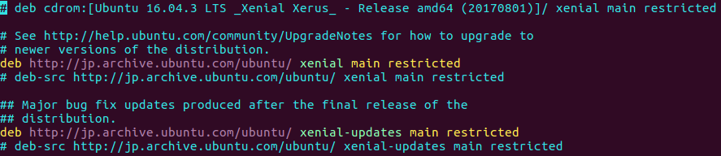

2. In the second form, `ppa:<user>/<ppa-name>`  will be expanded to the full deb line of the PPA and added into a new file in the `/etc/apt/sources.list.d/` directory. The GPG public key of the newly added PPA will also be downloaded and added to apt's keyring.

    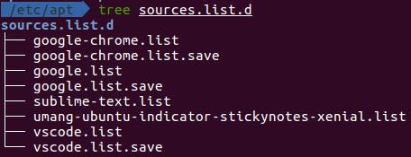

3. In the third form, the given distribution component will be enabled for all sources.

## Options

- `-r`

    Remove the specified repository


## How to find and remove obsolete PPA repositories on Ubuntu

> Err http://ppa.launchpad.net trusty/main amd64 Packages  404  Not Found  
> Err http://ppa.launchpad.net trusty/main i386 Packages  404  Not Found
> W: Failed to fetch http://ppa.launchpad.net/finalterm/daily/ubuntu/dists/trusty/main/binary-amd64/Packages  404  Not Found
> 
> W: Failed to fetch http://ppa.launchpad.net/finalterm/daily/ubuntu/dists/trusty/main/binary-i386/Packages  404  Not Found
> 
> E: Some index files failed to download. They have been ignored, or old ones used instead.

When you attempt to update APT package indexes, "404 Not Found" errors can often happen after distro upgrade. That is, after you upgraded your Ubuntu release, some third-party PPA repositories which you added on the old release are no longer supported on the upgraded release. In that case, you can ***identify and purge those broken PPA repositories as follows.***

### Step 1: Find out the PPAs which cause "404 Not Found" failures.

```
sudo apt-get update | grep "Failed"
```

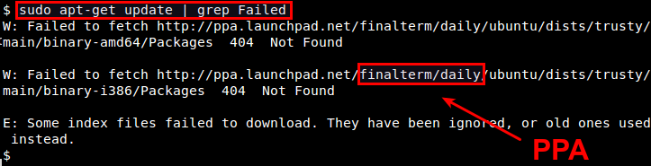

In this example, the PPA repository which is no longer supported in Ubuntu Trusty is "ppa:finalterm/daily".

### Step 2: Go ahead and remove the PPA repository.

```
sudo add-apt-repository --remove ppa:finalterm/daily
```

You have to repeat this process for every obsolete PPA repository that you found from above.

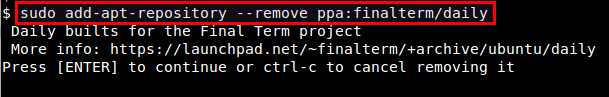

After removing all obsolete PPA repositories, re-run "apt-get update" to check all of them have been successfully removed.


# Part 2: `apt-get`

## Options

- `apt-get update`

    在安装任何软件之前，我们最好是要更新本地软件包索引（package index）。本地软件包索引列出了软件仓库中所有可安装的软件包以及版本信息。

    ```
    sudo apt-get update
    ```

    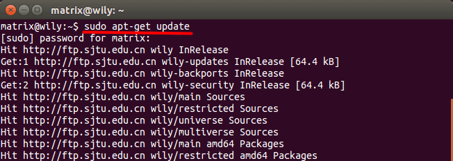

- `apt-get install`

    `apt-get install`是用来安装软件包的。你需要将软件包的名字添加到`apt-get install`之后．例如，你可以在Ubuntu系统上安装Chromium浏览器。

    ```
    sudo apt-get install chromium-browser
    ```
    
    有时候`apt-get`会询问你是否真的要安装软件包。如果你想自动回答yes，可以在安装命令中添加 `-y` 选项．

    ```
    sudo apt-get install -y chromium-browser
    ```

    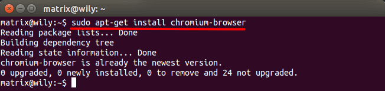

    在上图中你可以看到，我的Ubuntu系统上已经安装好了Chromium浏览器．

    在你用`apt-get install`命令安装软件包之前，你需要知道这个软件包在软件仓库中的名称．这看起来有点麻烦．当你熟悉之后，你会感到非常方便．尤其是当你SSH远程管理Linux服务器的时候．

    > `apt-get`首先会从软件仓库中下载deb安装包，这些deb安装在`/var/cache/apt/archives`目录下．下载后，`apt-get`会自动安装软件包

    `apt-get install`可以一次性安装多个软件包，比如

    ```
    sudo apt-get install wireshark nmap aircrack-ng
    ```
    
    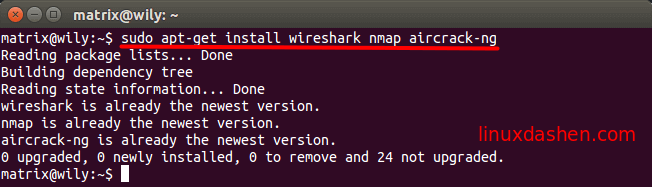

- `apt-get upgrade`

    `apt-get upgrade`命令用来升级系统上可以升级的软件包．

    ```
    sudo apt-get upgrade
    ```
    
    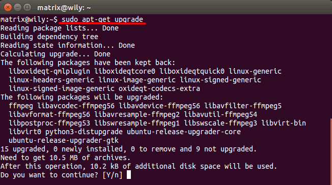

- `apt-get remove`

    这条命令用来删除系统上的软件包，比如，删除Firefox

    ```
    sudo apt-get remove firefox
    ```

    它不会删除软件包的配置文件．

- `apt-get purge`

    这条命令可以用来删除软件包及其配置文件．

    ```
    sudo apt-get purge firefox
    ```

- `apt-get clean`

    当`apt-get`安装或升级软件包时，它会将deb安装包下载到文件系统的`/var/cache/apt/archives`目录下．软件包安装完成后，这些deb安装包基本上就没有什么用处了．`apt-get clean`命令可以帮你删除这些deb安装包．

    你可以使用下面的命令查看`/var/cache/apt/archives`目录下deb安装包的大小．

    ```
    du -sh /var/cache/apt/archives
    ```
    
    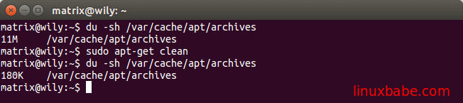

- `apt-get autoclean`

    `apt-get autoclean`也可以用来删除`/var/cache/apt/archives`目录下的deb安装包．但它只删除那些已经不能从软件仓库中下载的deb安装包．这就是说，Debian或Ubuntu已经不维护那些软件包了，或者那些软件包有了一个新的名字．

- `apt-get autoremove`

    这条命令用来删除不需要的依赖软件包．

- `apt-get dist-upgrade`

    这条命令可能会让很多人感到困惑．在Debian系统上，你用这条命令升级系统版本，比如从Debian 7升级到Debian 8．但是在Ubuntu系统上，这条命令只会升级Linux内核以及之前没有被升级的软件包．升级Ubuntu的版本你需要用到do-release-upgrade命令．

    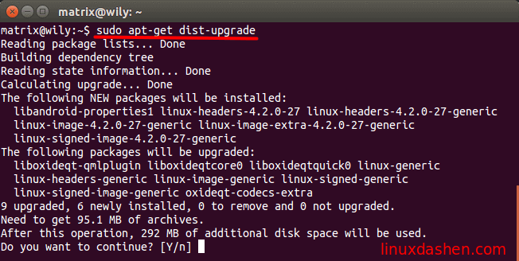

## 附：手动安装Deb软件包

- `dpkg -i`

    如果你从网站上下载了一个deb软件包，那么你需要dpkg工具来安装这个deb包．例如，你可以下载WPS linux版．然后，在终端里将当前工作目录切换到下载目录，再输入下面的命令安装WPS  Linux版．

    ```
    sudo dpkg -i wps-office*.deb
    ```

- `gdebi`

    dpkg的一个缺点是它不能解决依赖关系．你必须手动安装依赖包．而gdebi可以帮助我们自动安装依赖包．输入下面的命令安装gdebi

    ```
    sudo apt-get install gdebi
    ```

    它的命令语法如下：
    
    ```
    sudo gdebi <package.deb>
    ```

    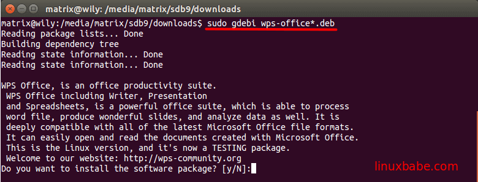

## References

1. [Debian & Ubuntu最实用的apt-get命令详解](https://www.linuxdashen.com/apt-get%E8%BD%AF%E4%BB%B6%E5%8C%85%E7%AE%A1%E7%90%86%E5%99%A8%E7%9A%84%E5%9F%BA%E6%9C%AC%E7%94%A8%E6%B3%95)


# Part 3: `apt`

Ubuntu 16.04 发布时，一个引人注目的新特性便是 `apt` 命令的引入。其实早在 2014 年，`apt` 命令就已经发布了第一个稳定版，只是直到 2016 年的 Ubuntu 16.04 系统发布时才开始引人关注。

随着 `apt install package` 命令的使用频率和普遍性逐步超过 `apt-get install package`，越来越多的其它 Linux 发行版也开始遵循 Ubuntu 的脚步，开始鼓励用户使用 `apt` 而不是 `apt-get`。

那么，`apt-get` 与 `apt` 命令之间到底有什么区别呢？如果它们有类似的命令结构，为什么还需要新的 `apt` 命令呢？是否 `apt` 真的比 `apt-get` 更好？普通用户应该使用新的 apt 命令还是坚持旧有习惯继续使用 `apt-get` 呢？

系统极客将在本文中解释所有这些问题，我们希望本文结束时，你将会有一个更清晰的了解。

## apt与apt-get

在开始对比 `apt` 与 `apt-get` 命令的区别之前，我们先来看看这两个命令的背景，以及它们要试图达到的目的。

Debian 作为 Ubuntu、Linux Mint 和 elementary OS 等 Linux 操作系统的母板，其具有强健的「包管理」系统，它的每个组件和应用程序都内置在系统中安装的软件包中。Debian 使用一套名为** Advanced Packaging Tool（APT）**的工具来管理这种包系统，不过请不要把它与 `apt` 命令混淆，它们之间是其实不是同一个东西。

在基于 Debian 的 Linux 发行版中，有各种工具可以与 APT 进行交互，以方便用户安装、删除和管理的软件包。`apt-get` 便是其中一款广受欢迎的命令行工具，另外一款较为流行的是 **Aptitude** 这一命令行与 GUI 兼顾的小工具。

如果你已阅读过我们的 `apt-get` 命令指南，可能已经遇到过许多类似的命令，如`apt-cache`、`apt-config` 等。如你所见，这些命令都比较低级又包含众多功能，普通的 Linux 用户也许永远都不会使用到。换种说法来说，就是最常用的 Linux 包管理命令都被分散在了 `apt-get`、`apt-cache` 和 `apt-config` 这三条命令当中。

`apt` 命令的引入就是为了解决命令过于分散的问题，它包括了 `apt-get` 命令出现以来使用最广泛的功能选项，以及 `apt-cache` 和 `apt-config` 命令中很少用到的功能。

在使用 `apt` 命令时，用户不必再由 `apt-get` 转到 `apt-cache` 或 `apt-config`，而且 `apt` 更加结构化，并为用户提供了管理软件包所需的必要选项。

> 简单来说就是：apt = apt-get、apt-cache 和 apt-config 中最常用命令选项的集合。

### apt与apt-get之间的区别

通过 `apt` 命令，用户可以在同一地方集中得到所有必要的工具，`apt` 的主要目的是提供一种以「让终端用户满意」的方式来处理 Linux 软件包的有效方式。

`apt` 具有更精减但足够的命令选项，而且参数选项的组织方式更为有效。除此之外，它默认启用的几个特性对最终用户也非常有帮助。例如，可以在使用 `apt` 命令安装或删除程序时看到进度条。

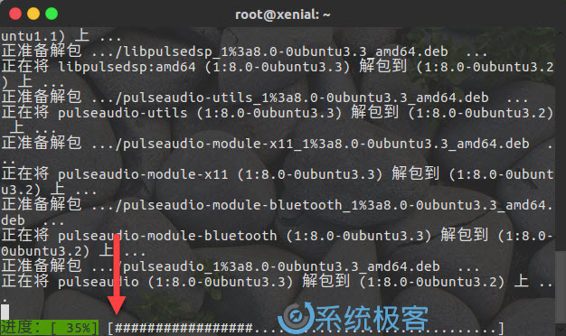

`apt` 还会在更新存储库数据库时提示用户可升级的软件包个数。

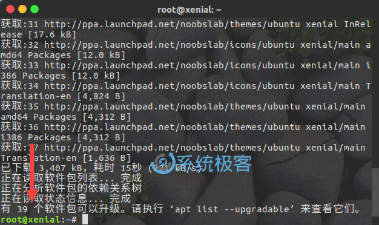

如果你使用 `apt` 的其它命令选项，也可以实现与使用 `apt-get` 时相同的操作。

### apt和apt-get命令之间的区别

虽然`apt`与`apt-get`有一些类似的命令选项，但它并不能完全向下兼容`apt-get`命令。也就是说，可以用`apt`替换部分`apt-get`系列命令，但不是全部。

| apt 命令 | 取代的命令 | 命令的功能 |
| :--- | :--- | :--- |
| apt update | apt-get update | 刷新存储库索引 |
| apt install | apt-get install | 安装软件包 |
| apt remove | apt-get remove | 移除软件包 |
| apt purge | apt-get purge | 移除软件包及配置文件 |
| apt autoremove | apt-get autoremove | 自动删除不需要的包 |
| apt upgrade | apt-get upgrade | 升级所有可升级的软件包 |
| apt full-upgrade | apt-get dist-upgrade | 在升级软件包时自动处理依赖关系 |
| apt search | apt-cache search | 搜索应用程序 |
| apt show | apt-cache show | 显示装细节 |

当然，apt 还有一些自己的命令：

| 新的apt命令 | 命令的功能 |
| :--- | :--- |
| apt list | 列出包含条件的包（已安装，可升级等）|
| apt edit-sources | 编辑源列表 |

> `list` is somewhat similar to `dpkg-query --list` in that it can display a list of packages satisfying certain criteria. It supports `glob(7)` patterns for matching package names as well as options to list installed (**--installed**), upgradeable (**--upgradeable**) or all available (**--all-versions**) versions.

需要大家注意的是：apt 命令也还在不断发展， 因此，你可能会在将来的版本中看到新的选项。

### apt-get已弃用？

目前还没有任何 Linux 发行版官方放出 `apt-get` 将被停用的消息，至少它还有比 `apt` 更多、更细化的操作功能。对于低级操作，仍然需要 `apt-get`。

## 我应该使用apt还是apt-get？

既然两个命令都有用，那么我该使用 `apt` 还是 `apt-get` 呢？作为一个常规 Linux 用户，系统极客建议大家尽快适应并开始首先使用 `apt`。不仅因为广大 Linux 发行商都在推荐 `apt`，更主要的还是它提供了 Linux 包管理的必要选项。

最重要的是，`apt` 命令选项更少更易记，因此也更易用，所以没理由继续坚持 `apt-get`。

## 小结

最后结大家提供两点使用上的建议：

- `apt` 可以看作 `apt-get` 和 `apt-cache` 命令的子集, 可以为包管理提供必要的命令选项。
- `apt-get` 虽然没被弃用，但作为普通用户，还是应该首先使用 `apt`。

## References

1. [Linux中apt与apt-get命令的区别与解释](https://www.sysgeek.cn/apt-vs-apt-get/)
