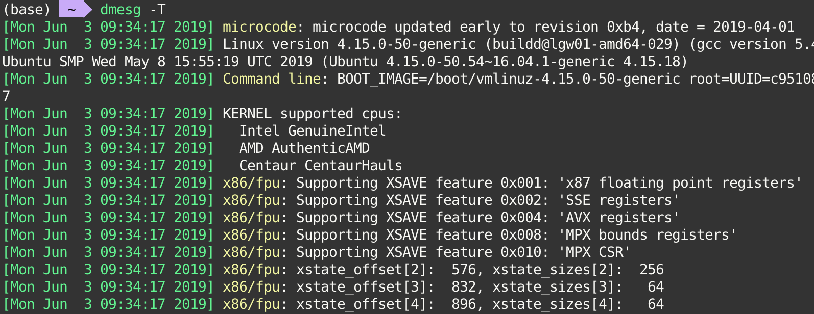

#### Description

`dmesg` is used to examine or control the kernel ring buffer. The default action is to display all messages from the kernel ring buffer.

> The kernel ring buffer is a data structure that records messages related to the operation of the kernel. A ring buffer is a special kind of buffer that is always a constant size, removing the oldest messages when new messages come in.

#### Synopsis

- `dmesg [options]`

#### Options

- `-T, --ctime`

    Print human-readable timestamps.

    > Be aware that the timestamp could be inaccurate! The time source used for the logs is not updated after system SUSPEND/RESUME.

    
