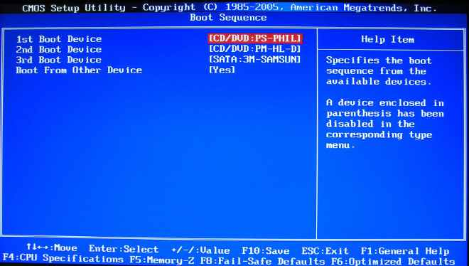

**Table of contents**

- [Part 1: 计算机是如何启动的？](#part-1-计算机是如何启动的)
    - [boot的含义](#boot的含义)
    - [第一阶段：BIOS](#第一阶段bios)
        - [硬件自检](#硬件自检)
        - [启动顺序](#启动顺序)
    - [第二阶段：主引导记录](#第二阶段主引导记录)
        - [主引导记录的结构](#主引导记录的结构)
        - [分区表](#分区表)
    - [第三阶段：硬盘启动](#第三阶段硬盘启动)
        - [情况A：卷引导记录](#情况a卷引导记录)
        - [情况B：扩展分区和逻辑分区](#情况b扩展分区和逻辑分区)
        - [情况C：启动管理器](#情况c启动管理器)
    - [第四阶段：操作系统](#第四阶段操作系统)
    - [References](#references)
- [Part 2: Linux的启动流程](#part-2-linux的启动流程)
    - [第一步、加载内核](#第一步加载内核)
    - [第二步、启动初始化进程](#第二步启动初始化进程)
    - [第三步、确定运行级别](#第三步确定运行级别)
    - [第四步、加载开机启动程序](#第四步加载开机启动程序)
    - [第五步、用户登录](#第五步用户登录)
    - [第六步、进入 login shell](#第六步进入-login-shell)
    - [第七步，打开 non-login shell](#第七步打开-non-login-shell)
    - [References](#references-1)
- [Part 3: systemd入门教程：命令篇](#part-3-systemd入门教程命令篇)
    - [一、由来](#一由来)
    - [二、Systemd 概述](#二systemd-概述)
    - [三、系统管理](#三系统管理)
    - [四、Unit](#四unit)
    - [五、Unit 的配置文件](#五unit-的配置文件)
    - [六、Target](#六target)
    - [七、日志管理](#七日志管理)
    - [References](#references-2)
- [Part 4: systemd入门教程：实战篇](#part-4-systemd入门教程实战篇)
    - [一、开机启动](#一开机启动)
    - [二、启动服务](#二启动服务)
    - [三、停止服务](#三停止服务)
    - [四、读懂配置文件](#四读懂配置文件)
    - [五、 [Unit] 区块：启动顺序与依赖关系。](#五-unit-区块启动顺序与依赖关系)
    - [六、[Service] 区块：启动行为](#六service-区块启动行为)
    - [七、[Install] 区块](#七install-区块)
    - [八、Target 的配置文件](#八target-的配置文件)
    - [九、修改配置文件后重启](#九修改配置文件后重启)
    - [References](#references-3)


# Part 1: 计算机是如何启动的？

从打开电源到开始操作，计算机的启动是一个非常复杂的过程。我一直搞不清楚，这个过程到底是怎么回事，只看见屏幕快速滚动各种提示...... 这几天，我查了一些资料，试图搞懂它。下面就是我整理的笔记。

## boot的含义

先问一个问题，"启动"用英语怎么说？

回答是boot。可是，boot原来的意思是靴子，"启动"与靴子有什么关系呢？ 原来，这里的boot是bootstrap（鞋带）的缩写，它来自一句谚语：

```
"pull oneself up by one's bootstraps"
```

字面意思是"拽着鞋带把自己拉起来"，这当然是不可能的事情。最早的时候，工程师们用它来比喻，计算机启动是一个很矛盾的过程：必须先运行程序，然后计算机才能启动，但是计算机不启动就无法运行程序！

早期真的是这样，必须想尽各种办法，把一小段程序装进内存，然后计算机才能正常运行。所以，工程师们把这个过程叫做"拉鞋带"，久而久之就简称为boot了。

计算机的整个启动过程分成四个阶段。

## 第一阶段：BIOS

上个世纪70年代初，"只读内存"（read-only memory，缩写为ROM）发明，开机程序被刷入ROM芯片，计算机通电后，第一件事就是读取它。

这块芯片里的程序叫做"基本輸出輸入系統"（Basic Input/Output System），简称为BIOS。

### 硬件自检

BIOS程序首先检查，计算机硬件能否满足运行的基本条件，这叫做"硬件自检"（Power-On Self-Test），缩写为POST。

如果硬件出现问题，主板会发出不同含义的蜂鸣，启动中止。如果没有问题，屏幕就会显示出CPU、内存、硬盘等信息。


### 启动顺序

硬件自检完成后，BIOS把控制权转交给下一阶段的启动程序。

这时，BIOS需要知道，"下一阶段的启动程序"具体存放在哪一个设备。也就是说，BIOS需要有一个外部储存设备的排序，排在前面的设备就是优先转交控制权的设备。这种排序叫做"启动顺序"（Boot Sequence）。

打开BIOS的操作界面，里面有一项就是"设定启动顺序"。



## 第二阶段：主引导记录

BIOS按照"启动顺序"，把控制权转交给排在第一位的储存设备。

这时，计算机读取该设备的第一个扇区，也就是读取最前面的512个字节。如果这512个字节的最后两个字节是0x55和0xAA，表明这个设备可以用于启动；如果不是，表明设备不能用于启动，控制权于是被转交给"启动顺序"中的下一个设备。

这最前面的512个字节，就叫做"主引导记录"（Master boot record，缩写为MBR）。

### 主引导记录的结构

"主引导记录"只有512个字节，放不了太多东西。它的主要作用是，告诉计算机到硬盘的哪一个位置去找操作系统。

主引导记录由三个部分组成：

```
（1） 第1-446字节：调用操作系统的机器码。

（2） 第447-510字节：分区表（Partition table）。

（3） 第511-512字节：主引导记录签名（0x55和0xAA）。
```

其中，第二部分"分区表"的作用，是将硬盘分成若干个区。

### 分区表

硬盘分区有很多好处。考虑到每个区可以安装不同的操作系统，"主引导记录"因此必须知道将控制权转交给哪个区。

分区表的长度只有64个字节，里面又分成四项，每项16个字节。所以，一个硬盘最多只能分四个一级分区，又叫做"主分区"。

每个主分区的16个字节，由6个部分组成：

```
（1） 第1个字节：如果为0x80，就表示该主分区是激活分区，控制权要转交给这个分区。四个主分区里面只能有一个是激活的。

（2） 第2-4个字节：主分区第一个扇区的物理位置（柱面、磁头、扇区号等等）。

（3） 第5个字节：主分区类型。

（4） 第6-8个字节：主分区最后一个扇区的物理位置。

（5） 第9-12字节：该主分区第一个扇区的逻辑地址。

（6） 第13-16字节：主分区的扇区总数。
```

最后的四个字节（"主分区的扇区总数"），决定了这个主分区的长度。也就是说，一个主分区的扇区总数最多不超过2的32次方。

如果每个扇区为512个字节，就意味着单个分区最大不超过2TB。再考虑到扇区的逻辑地址也是32位，所以单个硬盘可利用的空间最大也不超过2TB。如果想使用更大的硬盘，只有2个方法：一是提高每个扇区的字节数，二是增加扇区总数。

## 第三阶段：硬盘启动

这时，计算机的控制权就要转交给硬盘的某个分区了，这里又分成三种情况。

### 情况A：卷引导记录

上一节提到，四个主分区里面，只有一个是激活的。计算机会读取激活分区的第一个扇区，叫做"卷引导记录"（Volume boot record，缩写为VBR）。

"卷引导记录"的主要作用是，告诉计算机，操作系统在这个分区里的位置。然后，计算机就会加载操作系统了。

### 情况B：扩展分区和逻辑分区

随着硬盘越来越大，四个主分区已经不够了，需要更多的分区。但是，分区表只有四项，因此规定有且仅有一个区可以被定义成"扩展分区"（Extended partition）。

所谓"扩展分区"，就是指这个区里面又分成多个区。这种分区里面的分区，就叫做"逻辑分区"（logical partition）。

计算机先读取扩展分区的第一个扇区，叫做"扩展引导记录"（Extended boot record，缩写为EBR）。它里面也包含一张64字节的分区表，但是最多只有两项（也就是两个逻辑分区）。

计算机接着读取第二个逻辑分区的第一个扇区，再从里面的分区表中找到第三个逻辑分区的位置，以此类推，直到某个逻辑分区的分区表只包含它自身为止（即只有一个分区项）。因此，扩展分区可以包含无数个逻辑分区。

但是，似乎很少通过这种方式启动操作系统。如果操作系统确实安装在扩展分区，一般采用下一种方式启动。

### 情况C：启动管理器

在这种情况下，计算机读取"主引导记录"前面446字节的机器码之后，不再把控制权转交给某一个分区，而是运行事先安装的"启动管理器"（boot loader），由用户选择启动哪一个操作系统。

Linux环境中，目前最流行的启动管理器是Grub。


## 第四阶段：操作系统

控制权转交给操作系统后，操作系统的内核首先被载入内存。

以Linux系统为例，先载入`/boot`目录下面的kernel。内核加载成功后，第一个运行的程序是`/sbin/init`。它根据配置文件（Debian系统是`/etc/initab`）产生init进程。这是Linux启动后的第一个进程，pid进程编号为1，其他进程都是它的后代。

然后，init线程加载系统的各个模块，比如窗口程序和网络程序，直至执行`/bin/login`程序，跳出登录界面，等待用户输入用户名和密码。

至此，全部启动过程完成。

## References

1. [计算机是如何启动的？](http://www.ruanyifeng.com/blog/2013/02/booting.html)

# Part 2: Linux的启动流程

半年前，我写了《计算机是如何启动的？》，探讨BIOS和主引导记录的作用。

那篇文章不涉及操作系统，只与主板的板载程序有关。今天，我想接着往下写，探讨操作系统接管硬件以后发生的事情，也就是操作系统的启动流程。


这个部分比较有意思。因为在BIOS阶段，计算机的行为基本上被写死了，程序员可以做的事情并不多；但是，一旦进入操作系统，程序员几乎可以定制所有方面。所以，这个部分与程序员的关系更密切。

我主要关心的是Linux操作系统，它是目前服务器端的主流操作系统。下面的内容针对的是Debian发行版，因为我对其他发行版不够熟悉。

## 第一步、加载内核

操作系统接管硬件以后，首先读入`/boot`目录下的内核文件。


以我的电脑为例，`/boot`目录下面大概是这样一些文件：

```
$ ls /boot

config-3.2.0-3-amd64
config-3.2.0-4-amd64
grub
initrd.img-3.2.0-3-amd64
initrd.img-3.2.0-4-amd64
System.map-3.2.0-3-amd64
System.map-3.2.0-4-amd64
vmlinuz-3.2.0-3-amd64
vmlinuz-3.2.0-4-amd64
```

## 第二步、启动初始化进程

内核文件加载以后，就开始运行第一个程序`/sbin/init`，它的作用是初始化系统环境。


由于init是第一个运行的程序，它的进程编号（pid）就是1。其他所有进程都从它衍生，都是它的子进程。

## 第三步、确定运行级别

许多程序需要开机启动。它们在Windows叫做"服务"（service），在Linux就叫做"守护进程"（daemon）。

init进程的一大任务，就是去运行这些开机启动的程序。但是，不同的场合需要启动不同的程序，比如用作服务器时，需要启动Apache，用作桌面就不需要。Linux允许为不同的场合，分配不同的开机启动程序，这就叫做"运行级别"（runlevel）。也就是说，启动时根据"运行级别"，确定要运行哪些程序。


Linux预置七种运行级别（0-6）。一般来说，0是关机，1是单用户模式（也就是维护模式），6是重启。运行级别2-5，各个发行版不太一样，对于Debian来说，都是同样的多用户模式（也就是正常模式）。

init进程首先读取文件`/etc/inittab`，它是运行级别的设置文件。如果你打开它，可以看到第一行是这样的：

```
id:2:initdefault:
```

initdefault的值是2，表明系统启动时的运行级别为2。如果需要指定其他级别，可以手动修改这个值。

那么，运行级别2有些什么程序呢，系统怎么知道每个级别应该加载哪些程序呢？......回答是每个运行级别在`/etc`目录下面，都有一个对应的子目录，指定要加载的程序。

```
/etc/rc0.d
/etc/rc1.d
/etc/rc2.d
/etc/rc3.d
/etc/rc4.d
/etc/rc5.d
/etc/rc6.d
```

上面目录名中的"rc"，表示run command（运行程序），最后的d表示directory（目录）。下面让我们看看`/etc/rc2.d`目录中到底指定了哪些程序。

```
$ ls  /etc/rc2.d

README
S01motd
S13rpcbind
S14nfs-common
S16binfmt-support
S16rsyslog
S16sudo
S17apache2
S18acpid
...
```

可以看到，除了第一个文件README以外，其他文件名都是"字母S+两位数字+程序名"的形式。字母S表示Start，也就是启动的意思（启动脚本的运行参数为start），如果这个位置是字母K，就代表Kill（关闭），即如果从其他运行级别切换过来，需要关闭的程序（启动脚本的运行参数为stop）。后面的两位数字表示处理顺序，数字越小越早处理，所以第一个启动的程序是motd，然后是rpcbing、nfs......数字相同时，则按照程序名的字母顺序启动，所以rsyslog会先于sudo启动。

这个目录里的所有文件（除了README），就是启动时要加载的程序。如果想增加或删除某些程序，不建议手动修改`/etc/rcN.d`目录，最好是用一些专门命令进行管理（参考这里和这里）。

## 第四步、加载开机启动程序

前面提到，七种预设的"运行级别"各自有一个目录，存放需要开机启动的程序。不难想到，如果多个"运行级别"需要启动同一个程序，那么这个程序的启动脚本，就会在每一个目录里都有一个拷贝。这样会造成管理上的困扰：如果要修改启动脚本，岂不是每个目录都要改一遍？

Linux的解决办法，就是七个`/etc/rcN.d`目录里列出的程序，都设为链接文件，指向另外一个目录`/etc/init.d`，真正的启动脚本都统一放在这个目录中。init进程逐一加载开机启动程序，其实就是运行这个目录里的启动脚本。


下面就是链接文件真正的指向。

```
$ ls -l /etc/rc2.d

README
S01motd -> ../init.d/motd
S13rpcbind -> ../init.d/rpcbind
S14nfs-common -> ../init.d/nfs-common
S16binfmt-support -> ../init.d/binfmt-support
S16rsyslog -> ../init.d/rsyslog
S16sudo -> ../init.d/sudo
S17apache2 -> ../init.d/apache2
S18acpid -> ../init.d/acpid
```

这样做的另一个好处，就是如果你要手动关闭或重启某个进程，直接到目录`/etc/init.d`中寻找启动脚本即可。比如，我要重启Apache服务器，就运行下面的命令：

```
$ sudo /etc/init.d/apache2 restart
```

`/etc/init.d`这个目录名最后一个字母d，是directory的意思，表示这是一个目录，用来与程序`/etc/init`区分。

## 第五步、用户登录

开机启动程序加载完毕以后，就要让用户登录了。


一般来说，用户的登录方式有三种：

```
（1）命令行登录

（2）ssh登录

（3）图形界面登录
```

这三种情况，都有自己的方式对用户进行认证。

（1）命令行登录：init进程调用getty程序（意为get teletype），让用户输入用户名和密码。输入完成后，再调用login程序，核对密码（Debian还会再多运行一个身份核对程序`/etc/pam.d/login`）。如果密码正确，就从文件`/etc/passwd`读取该用户指定的shell，然后启动这个shell。

（2）ssh登录：这时系统调用sshd程序（Debian还会再运行`/etc/pam.d/ssh`），取代getty和login，然后启动shell。

（3）图形界面登录：init进程调用显示管理器，Gnome图形界面对应的显示管理器为gdm（GNOME Display Manager），然后用户输入用户名和密码。如果密码正确，就读取`/etc/gdm3/Xsession`，启动用户的会话。

## 第六步、进入 login shell

所谓shell，简单说就是命令行界面，让用户可以直接与操作系统对话。用户登录时打开的shell，就叫做login shell。


Debian默认的shell是Bash，它会读入一系列的配置文件。上一步的三种情况，在这一步的处理，也存在差异。

（1）命令行登录：首先读入`/etc/profile`，这是对所有用户都有效的配置；然后依次寻找下面三个文件，这是针对当前用户的配置。

```
~/.bash_profile
~/.bash_login
~/.profile
```

需要注意的是，这三个文件只要有一个存在，就不再读入后面的文件了。比如，要是`~/.bash_profile`存在，就不会再读入后面两个文件了。

（2）ssh登录：与第一种情况完全相同。

（3）图形界面登录：只加载`/etc/profile`和`~/.profile`。也就是说，`~/.bash_profile`不管有没有，都不会运行。

## 第七步，打开 non-login shell

老实说，上一步完成以后，Linux的启动过程就算结束了，用户已经可以看到命令行提示符或者图形界面了。但是，为了内容的完整，必须再介绍一下这一步。

用户进入操作系统以后，常常会再手动开启一个shell。这个shell就叫做 non-login shell，意思是它不同于登录时出现的那个shell，不读取`/etc/profile`和`.profile`等配置文件。


non-login shell的重要性，不仅在于它是用户最常接触的那个shell，还在于它会读入用户自己的bash配置文件`~/.bashrc`。大多数时候，我们对于bash的定制，都是写在这个文件里面的。

你也许会问，要是不进入 non-login shell，岂不是`.bashrc`就不会运行了，因此bash 也就不能完成定制了？事实上，Debian已经考虑到这个问题了，请打开文件`~/.profile`，可以看到下面的代码：

```
if [ -n "$BASH_VERSION" ]; then
　　if [ -f "$HOME/.bashrc" ]; then
　　　　. "$HOME/.bashrc"
　　fi
fi
```

上面代码先判断变量`$BASH_VERSION`是否有值，然后判断主目录下是否存在`.bashrc`文件，如果存在就运行该文件。第三行开头的那个点，是source命令的简写形式，表示运行某个文件，写成`source ~/.bashrc`也是可以的。

因此，只要运行`~/.profile`文件，`~/.bashrc`文件就会连带运行。但是上一节的第一种情况提到过，如果存在`~/.bash_profile`文件，那么有可能不会运行`~/.profile`文件。解决这个问题很简单，把下面代码写入`.bash_profile`就行了。

```
if [ -f ~/.profile ]; then
  . ~/.profile
fi
```

这样一来，不管是哪种情况，`.bashrc`都会执行，用户的设置可以放心地都写入这个文件了。

Bash的设置之所以如此繁琐，是由于历史原因造成的。早期的时候，计算机运行速度很慢，载入配置文件需要很长时间，Bash的作者只好把配置文件分成了几个部分，阶段性载入。系统的通用设置放在`/etc/profile`，用户个人的、需要被所有子进程继承的设置放在`.profile`，不需要被继承的设置放在`.bashrc`。

顺便提一下，除了Linux以外， Mac OS X 使用的shell也是Bash。但是，它只加载`.bash_profile`，然后在`.bash_profile`里面调用`.bashrc`。而且，不管是ssh登录，还是在图形界面里启动shell窗口，都是如此。

## References

1. [Linux的启动流程](http://www.ruanyifeng.com/blog/2013/08/linux_boot_process.html)

# Part 3: systemd入门教程：命令篇

Systemd 是 Linux 系统工具，用来启动守护进程，已成为大多数发行版的标准配置。

本文介绍它的基本用法，分为上下两篇。今天介绍它的主要命令，下一篇介绍如何用于实战。

## 一、由来

历史上，Linux 的启动一直采用init进程。

下面的命令用来启动服务。

```
$ sudo /etc/init.d/apache2 start
# 或者
$ service apache2 start
```

这种方法有两个缺点。

一是启动时间长。init进程是串行启动，只有前一个进程启动完，才会启动下一个进程。

二是启动脚本复杂。init进程只是执行启动脚本，不管其他事情。脚本需要自己处理各种情况，这往往使得脚本变得很长。

## 二、Systemd 概述

Systemd 就是为了解决这些问题而诞生的。它的设计目标是，为系统的启动和管理提供一套完整的解决方案。

根据 Linux 惯例，字母d是守护进程（daemon）的缩写。 Systemd 这个名字的含义，就是它要守护整个系统。

使用了 Systemd，就不需要再用init了。Systemd 取代了initd，成为系统的第一个进程（PID 等于 1），其他进程都是它的子进程。

```
$ systemctl --version
```

上面的命令查看 Systemd 的版本。

Systemd 的优点是功能强大，使用方便，缺点是体系庞大，非常复杂。事实上，现在还有很多人反对使用 Systemd，理由就是它过于复杂，与操作系统的其他部分强耦合，违反"keep simple, keep stupid"的Unix 哲学。


## 三、系统管理

Systemd 并不是一个命令，而是一组命令，涉及到系统管理的方方面面。

### `systemctl`

`systemctl`是 Systemd 的主命令，用于管理系统。

```
# 重启系统
$ sudo systemctl reboot

# 关闭系统，切断电源
$ sudo systemctl poweroff

# CPU停止工作
$ sudo systemctl halt

# 暂停系统
$ sudo systemctl suspend

# 让系统进入冬眠状态
$ sudo systemctl hibernate

# 让系统进入交互式休眠状态
$ sudo systemctl hybrid-sleep

# 启动进入救援状态（单用户状态）
$ sudo systemctl rescue
```

### `systemd-analyze`

`systemd-analyze`命令用于查看启动耗时。

```
# 查看启动耗时
$ systemd-analyze

# 查看每个服务的启动耗时
$ systemd-analyze blame

# 显示瀑布状的启动过程流
$ systemd-analyze critical-chain

# 显示指定服务的启动流
$ systemd-analyze critical-chain atd.service
```

### `hostnamectl`

`hostnamectl`命令用于查看当前主机的信息。

```
# 显示当前主机的信息
$ hostnamectl

# 设置主机名。
$ sudo hostnamectl set-hostname rhel7
```

### `localectl`

`localectl`命令用于查看本地化设置。

```
# 查看本地化设置
$ localectl

# 设置本地化参数。
$ sudo localectl set-locale LANG=en_GB.utf8
$ sudo localectl set-keymap en_GB
```

### `timedatectl`

`timedatectl`命令用于查看当前时区设置。

```
# 查看当前时区设置
$ timedatectl

# 显示所有可用的时区
$ timedatectl list-timezones

# 设置当前时区
$ sudo timedatectl set-timezone America/New_York
$ sudo timedatectl set-time YYYY-MM-DD
$ sudo timedatectl set-time HH:MM:SS
```

### `loginctl`

`loginctl`命令用于查看当前登录的用户。

```
# 列出当前session
$ loginctl list-sessions

# 列出当前登录用户
$ loginctl list-users

# 列出显示指定用户的信息
$ loginctl show-user ruanyf
```

## 四、Unit

### 含义

Systemd 可以管理所有系统资源。不同的资源统称为 Unit（单位）。

Unit 一共分成12种。

- Service unit：系统服务
- Target unit：多个 Unit 构成的一个组
- Device Unit：硬件设备
- Mount Unit：文件系统的挂载点
- Automount Unit：自动挂载点
- Path Unit：文件或路径
- Scope Unit：不是由 Systemd 启动的外部进程
- Slice Unit：进程组
- Snapshot Unit：Systemd 快照，可以切回某个快照
- Socket Unit：进程间通信的 socket
- Swap Unit：swap 文件
- Timer Unit：定时器

`systemctl list-units`命令可以查看当前系统的所有 Unit 。

```
# 列出正在运行的 Unit
$ systemctl list-units

# 列出所有Unit，包括没有找到配置文件的或者启动失败的
$ systemctl list-units --all

# 列出所有没有运行的 Unit
$ systemctl list-units --all --state=inactive

# 列出所有加载失败的 Unit
$ systemctl list-units --failed

# 列出所有正在运行的、类型为 service 的 Unit
$ systemctl list-units --type=service
```

### Unit的状态

`systemctl status`命令用于查看系统状态和单个 Unit 的状态。

```
# 显示系统状态
$ systemctl status

# 显示单个 Unit 的状态
$ sysystemctl status bluetooth.service

# 显示远程主机的某个 Unit 的状态
$ systemctl -H root@rhel7.example.com status httpd.service
```

除了status命令，systemctl还提供了三个查询状态的简单方法，主要供脚本内部的判断语句使用。

```
# 显示某个 Unit 是否正在运行
$ systemctl is-active application.service

# 显示某个 Unit 是否处于启动失败状态
$ systemctl is-failed application.service

# 显示某个 Unit 服务是否建立了启动链接
$ systemctl is-enabled application.service
```

### Unit管理

对于用户来说，最常用的是下面这些命令，用于启动和停止 Unit（主要是 service）。

```
# 立即启动一个服务
$ sudo systemctl start apache.service

# 立即停止一个服务
$ sudo systemctl stop apache.service

# 重启一个服务
$ sudo systemctl restart apache.service

# 杀死一个服务的所有子进程
$ sudo systemctl kill apache.service

# 重新加载一个服务的配置文件
$ sudo systemctl reload apache.service

# 重载所有修改过的配置文件
$ sudo systemctl daemon-reload

# 显示某个 Unit 的所有底层参数
$ systemctl show httpd.service

# 显示某个 Unit 的指定属性的值
$ systemctl show -p CPUShares httpd.service

# 设置某个 Unit 的指定属性
$ sudo systemctl set-property httpd.service CPUShares=500
```

### 依赖关系

Unit 之间存在依赖关系：A 依赖于 B，就意味着 Systemd 在启动 A 的时候，同时会去启动 B。

`systemctl list-dependencies`命令列出一个 Unit 的所有依赖。

```
$ systemctl list-dependencies nginx.service
```

上面命令的输出结果之中，有些依赖是 Target 类型（详见下文），默认不会展开显示。如果要展开 Target，就需要使用`--all`参数。

```
$ systemctl list-dependencies --all nginx.service
```

## 五、Unit 的配置文件

### 概述

每一个 Unit 都有一个配置文件，告诉 Systemd 怎么启动这个 Unit 。

Systemd 默认从目录`/etc/systemd/system/`读取配置文件。但是，里面存放的大部分文件都是符号链接，指向录`/usr/lib/systemd/system/`，真正的配置文件存放在那个目录。

`systemctl enable`命令用于在上面两个目录之间，建立符号链接关系。

```
$ sudo systemctl enable clamd@scan.service
# 等同于
$ sudo ln -s '/usr/lib/systemd/system/clamd@scan.service' '/etc/systemd/system/multi-user.target.wants/clamd@scan.service'
```

如果配置文件里面设置了开机启动，`systemctl enable`命令相当于激活开机启动。

与之对应的，`systemctl disable`命令用于在两个目录之间，撤销符号链接关系，相当于撤销开机启动。

```
$ sudo systemctl disable clamd@scan.service
```

配置文件的后缀名，就是该 Unit 的种类，比如`sshd.socket`。如果省略，Systemd 默认后缀名为`.service`，所以sshd会被理解成`sshd.service`。

### 配置文件的状态

`systemctl list-unit-files`命令用于列出所有配置文件。

```
# 列出所有配置文件
$ systemctl list-unit-files

# 列出指定类型的配置文件
$ systemctl list-unit-files --type=service
```

这个命令会输出一个列表。

```
$ systemctl list-unit-files

UNIT FILE              STATE
chronyd.service        enabled
clamd@.service         static
clamd@scan.service     disabled
```

这个列表显示每个配置文件的状态，一共有四种。

- enabled：已建立启动链接
- disabled：没建立启动链接
- static：该配置文件没有[Install]部分（无法执行），只能作为其他配置文件的依赖
- masked：该配置文件被禁止建立启动链接

注意，从配置文件的状态无法看出，该 Unit 是否正在运行。这必须执行前面提到的`systemctl status`命令。

```
$ systemctl status bluetooth.service
```

一旦修改配置文件，就要让 SystemD 重新加载配置文件，然后重新启动，否则修改不会生效。

```
$ sudo systemctl daemon-reload
$ sudo systemctl restart httpd.service
```

### 配置文件的格式

配置文件就是普通的文本文件，可以用文本编辑器打开。

`systemctl cat`命令可以查看配置文件的内容。

```
$ systemctl cat atd.service

[Unit]
Description=ATD daemon

[Service]
Type=forking
ExecStart=/usr/bin/atd

[Install]
WantedBy=multi-user.target
```

从上面的输出可以看到，配置文件分成几个区块。每个区块的第一行，是用方括号表示的区别名，比如`[Unit]`。注意，配置文件的区块名和字段名，都是大小写敏感的。

每个区块内部是一些等号连接的键值对。

```
[Section]
Directive1=value
Directive2=value

. . .
```

注意，键值对的等号两侧不能有空格。

### 配置文件的区块

`[Unit]`区块通常是配置文件的第一个区块，用来定义 Unit 的元数据，以及配置与其他 Unit 的关系。它的主要字段如下。

- Description：简短描述
- Documentation：文档地址
- Requires：当前 Unit 依赖的其他 Unit，如果它们没有运行，当前 Unit 会启动失败
- Wants：与当前 Unit 配合的其他 Unit，如果它们没有运行，当前 Unit 不会启动失败
- BindsTo：与Requires类似，它指定的 Unit 如果退出，会导致当前 Unit 停止运行
- Before：如果该字段指定的 Unit 也要启动，那么必须在当前 Unit 之后启动
- After：如果该字段指定的 Unit 也要启动，那么必须在当前 Unit 之前启动
- Conflicts：这里指定的 Unit 不能与当前 Unit 同时运行
- Condition...：当前 Unit 运行必须满足的条件，否则不会运行
- Assert...：当前 Unit 运行必须满足的条件，否则会报启动失败

`[Install]`通常是配置文件的最后一个区块，用来定义如何启动，以及是否开机启动。它的主要字段如下。

- WantedBy：它的值是一个或多个 Target，当前 Unit 激活时（enable）符号链接会放入/etc/systemd/system目录下面以 Target 名 + .wants后缀构成的子目录中
- RequiredBy：它的值是一个或多个 Target，当前 Unit 激活时，符号链接会放入/etc/systemd/system目录下面以 Target 名 + .required后缀构成的子目录中
- Alias：当前 Unit 可用于启动的别名
- Also：当前 Unit 激活（enable）时，会被同时激活的其他 Unit

`[Service]`区块用来 Service 的配置，只有 Service 类型的 Unit 才有这个区块。它的主要字段如下。

- Type：定义启动时的进程行为。它有以下几种值。
- Type=simple：默认值，执行ExecStart指定的命令，启动主进程
- Type=forking：以 fork 方式从父进程创建子进程，创建后父进程会立即退出
- Type=oneshot：一次性进程，Systemd 会等当前服务退出，再继续往下执行
- Type=dbus：当前服务通过D-Bus启动
- Type=notify：当前服务启动完毕，会通知Systemd，再继续往下执行
- Type=idle：若有其他任务执行完毕，当前服务才会运行
- ExecStart：启动当前服务的命令
- ExecStartPre：启动当前服务之前执行的命令
- ExecStartPost：启动当前服务之后执行的命令
- ExecReload：重启当前服务时执行的命令
- ExecStop：停止当前服务时执行的命令
- ExecStopPost：停止当其服务之后执行的命令
- RestartSec：自动重启当前服务间隔的秒数
- Restart：定义何种情况 Systemd 会自动重启当前服务，可能的值包括always（总是重启）、on-success、on-failure、on-abnormal、on-abort、on-watchdog
- TimeoutSec：定义 Systemd 停止当前服务之前等待的秒数
- Environment：指定环境变量

## 六、Target

启动计算机的时候，需要启动大量的 Unit。如果每一次启动，都要一一写明本次启动需要哪些 Unit，显然非常不方便。Systemd 的解决方案就是 Target。

简单说，Target 就是一个 Unit 组，包含许多相关的 Unit 。启动某个 Target 的时候，Systemd 就会启动里面所有的 Unit。从这个意义上说，Target 这个概念类似于"状态点"，启动某个 Target 就好比启动到某种状态。

传统的`init`启动模式里面，有 RunLevel 的概念，跟 Target 的作用很类似。不同的是，RunLevel 是互斥的，不可能多个 RunLevel 同时启动，但是多个 Target 可以同时启动。

```
# 查看当前系统的所有 Target
$ systemctl list-unit-files --type=target

# 查看一个 Target 包含的所有 Unit
$ systemctl list-dependencies multi-user.target

# 查看启动时的默认 Target
$ systemctl get-default

# 设置启动时的默认 Target
$ sudo systemctl set-default multi-user.target

# 切换 Target 时，默认不关闭前一个 Target 启动的进程，
# systemctl isolate 命令改变这种行为，
# 关闭前一个 Target 里面所有不属于后一个 Target 的进程
$ sudo systemctl isolate multi-user.target
```

Target 与 传统 RunLevel 的对应关系如下。

```
Traditional runlevel      New target name     Symbolically linked to...

Runlevel 0           |    runlevel0.target -> poweroff.target
Runlevel 1           |    runlevel1.target -> rescue.target
Runlevel 2           |    runlevel2.target -> multi-user.target
Runlevel 3           |    runlevel3.target -> multi-user.target
Runlevel 4           |    runlevel4.target -> multi-user.target
Runlevel 5           |    runlevel5.target -> graphical.target
Runlevel 6           |    runlevel6.target -> reboot.target
```

它与`init`进程的主要差别如下。

（1）默认的 RunLevel（在`/etc/inittab`文件设置）现在被默认的 Target 取代，位置是`/etc/systemd/system/default.target`，通常符号链接到`graphical.target`（图形界面）或者`multi-user.target`（多用户命令行）。

（2）启动脚本的位置，以前是`/etc/init.d`目录，符号链接到不同的 RunLevel 目录 （比如`/etc/rc3.d`、`/etc/rc5.d`等），现在则存放在`/lib/systemd/system`和`/etc/systemd/system`目录。

（3）配置文件的位置，以前`init`进程的配置文件是`/etc/inittab`，各种服务的配置文件存放在`/etc/sysconfig`目录。现在的配置文件主要存放在`/lib/systemd`目录，在/`etc/systemd`目录里面的修改可以覆盖原始设置。

## 七、日志管理

Systemd 统一管理所有 Unit 的启动日志。带来的好处就是，可以只用`journalctl`一个命令，查看所有日志（内核日志和应用日志）。日志的配置文件是`/etc/systemd/journald.conf`。

`journalctl`功能强大，用法非常多。

```
# 查看所有日志（默认情况下 ，只保存本次启动的日志）
$ sudo journalctl

# 查看内核日志（不显示应用日志）
$ sudo journalctl -k

# 查看系统本次启动的日志
$ sudo journalctl -b
$ sudo journalctl -b -0

# 查看上一次启动的日志（需更改设置）
$ sudo journalctl -b -1

# 查看指定时间的日志
$ sudo journalctl --since="2012-10-30 18:17:16"
$ sudo journalctl --since "20 min ago"
$ sudo journalctl --since yesterday
$ sudo journalctl --since "2015-01-10" --until "2015-01-11 03:00"
$ sudo journalctl --since 09:00 --until "1 hour ago"

# 显示尾部的最新10行日志
$ sudo journalctl -n

# 显示尾部指定行数的日志
$ sudo journalctl -n 20

# 实时滚动显示最新日志
$ sudo journalctl -f

# 查看指定服务的日志
$ sudo journalctl /usr/lib/systemd/systemd

# 查看指定进程的日志
$ sudo journalctl _PID=1

# 查看某个路径的脚本的日志
$ sudo journalctl /usr/bin/bash

# 查看指定用户的日志
$ sudo journalctl _UID=33 --since today

# 查看某个 Unit 的日志
$ sudo journalctl -u nginx.service
$ sudo journalctl -u nginx.service --since today

# 实时滚动显示某个 Unit 的最新日志
$ sudo journalctl -u nginx.service -f

# 合并显示多个 Unit 的日志
$ journalctl -u nginx.service -u php-fpm.service --since today

# 查看指定优先级（及其以上级别）的日志，共有8级
# 0: emerg
# 1: alert
# 2: crit
# 3: err
# 4: warning
# 5: notice
# 6: info
# 7: debug
$ sudo journalctl -p err -b

# 日志默认分页输出，--no-pager 改为正常的标准输出
$ sudo journalctl --no-pager

# 以 JSON 格式（单行）输出
$ sudo journalctl -b -u nginx.service -o json

# 以 JSON 格式（多行）输出，可读性更好
$ sudo journalctl -b -u nginx.serviceqq
 -o json-pretty

# 显示日志占据的硬盘空间
$ sudo journalctl --disk-usage

# 指定日志文件占据的最大空间
$ sudo journalctl --vacuum-size=1G

# 指定日志文件保存多久
$ sudo journalctl --vacuum-time=1years
```

## References

1. [Systemd入门教程：命令篇](http://www.ruanyifeng.com/blog/2016/03/systemd-tutorial-commands.html)

# Part 4: systemd入门教程：实战篇

上一篇文章，我介绍了 Systemd 的主要命令，今天介绍如何使用它完成一些基本的任务。

## 一、开机启动

对于那些支持 Systemd 的软件，安装的时候，会自动在`/usr/lib/systemd/system`目录添加一个配置文件。

如果你想让该软件开机启动，就执行下面的命令（以`httpd.service`为例）。

```
$ sudo systemctl enable httpd
```

上面的命令相当于在`/etc/systemd/system`目录添加一个符号链接，指向`/usr/lib/systemd/system`里面的`httpd.service`文件。

这是因为开机时，Systemd只执行`/etc/systemd/system`目录里面的配置文件。这也意味着，如果把修改后的配置文件放在该目录，就可以达到覆盖原始配置的效果。

## 二、启动服务

设置开机启动以后，软件并不会立即启动，必须等到下一次开机。如果想现在就运行该软件，那么要执行`systemctl start`命令。

```
$ sudo systemctl start httpd
```

执行上面的命令以后，有可能启动失败，因此要用`systemctl status`命令查看一下该服务的状态。

```
$ sudo systemctl status httpd

httpd.service - The Apache HTTP Server
   Loaded: loaded (/usr/lib/systemd/system/httpd.service; enabled)
   Active: active (running) since 金 2014-12-05 12:18:22 JST; 7min ago
 Main PID: 4349 (httpd)
   Status: "Total requests: 1; Current requests/sec: 0; Current traffic:   0 B/sec"
   CGroup: /system.slice/httpd.service
           ├─4349 /usr/sbin/httpd -DFOREGROUND
           ├─4350 /usr/sbin/httpd -DFOREGROUND
           ├─4351 /usr/sbin/httpd -DFOREGROUND
           ├─4352 /usr/sbin/httpd -DFOREGROUND
           ├─4353 /usr/sbin/httpd -DFOREGROUND
           └─4354 /usr/sbin/httpd -DFOREGROUND

12月 05 12:18:22 localhost.localdomain systemd[1]: Starting The Apache HTTP Server...
12月 05 12:18:22 localhost.localdomain systemd[1]: Started The Apache HTTP Server.
12月 05 12:22:40 localhost.localdomain systemd[1]: Started The Apache HTTP Server.
```

上面的输出结果含义如下。

- Loaded行：配置文件的位置，是否设为开机启动
- Active行：表示正在运行
- Main PID行：主进程ID
- Status行：由应用本身（这里是 httpd ）提供的软件当前状态
- CGroup块：应用的所有子进程
- 日志块：应用的日志

## 三、停止服务

终止正在运行的服务，需要执行`systemctl stop`命令。

```
$ sudo systemctl stop httpd.service
```

有时候，该命令可能没有响应，服务停不下来。这时候就不得不"杀进程"了，向正在运行的进程发出`kill`信号。

```
$ sudo systemctl kill httpd.service
```

此外，重启服务要执行`systemctl restart`命令。

```
$ sudo systemctl restart httpd.service
```

## 四、读懂配置文件

一个服务怎么启动，完全由它的配置文件决定。下面就来看，配置文件有些什么内容。

前面说过，配置文件主要放在`/usr/lib/systemd/system`目录，也可能在`/etc/systemd/system`目录。找到配置文件以后，使用文本编辑器打开即可。

`systemctl cat`命令可以用来查看配置文件，下面以`sshd.service`文件为例，它的作用是启动一个 SSH 服务器，供其他用户以 SSH 方式登录。

```
$ systemctl cat sshd.service

[Unit]
Description=OpenSSH server daemon
Documentation=man:sshd(8) man:sshd_config(5)
After=network.target sshd-keygen.service
Wants=sshd-keygen.service

[Service]
EnvironmentFile=/etc/sysconfig/sshd
ExecStart=/usr/sbin/sshd -D $OPTIONS
ExecReload=/bin/kill -HUP $MAINPID
Type=simple
KillMode=process
Restart=on-failure
RestartSec=42s

[Install]
WantedBy=multi-user.target
```

可以看到，配置文件分成几个区块，每个区块包含若干条键值对。

下面依次解释每个区块的内容。

## 五、 [Unit] 区块：启动顺序与依赖关系。

`Unit`区块的`Description`字段给出当前服务的简单描述，`Documentation`字段给出文档位置。

接下来的设置是启动顺序和依赖关系，这个比较重要。

`After`字段：表示如果`network.target`或`sshd-keygen.service`需要启动，那么`sshd.service`应该在它们之后启动。

相应地，还有一个`Before`字段，定义`sshd.service`应该在哪些服务之前启动。

注意，`After`和`Before`字段只涉及启动顺序，不涉及依赖关系。

举例来说，某 Web 应用需要 postgresql 数据库储存数据。在配置文件中，它只定义要在 postgresql 之后启动，而没有定义依赖 postgresql 。上线后，由于某种原因，postgresql 需要重新启动，在停止服务期间，该 Web 应用就会无法建立数据库连接。

设置依赖关系，需要使用`Wants`字段和`Requires`字段。

`Wants`字段：表示`sshd.service`与`sshd-keygen.service`之间存在"弱依赖"关系，即如果"sshd-keygen.service"启动失败或停止运行，不影响`sshd.service`继续执行。

`Requires`字段则表示"强依赖"关系，即如果该服务启动失败或异常退出，那么`sshd.service`也必须退出。

注意，`Wants`字段与`Requires`字段只涉及依赖关系，与启动顺序无关，默认情况下是同时启动的。

## 六、[Service] 区块：启动行为

`Service`区块定义如何启动当前服务。

### 6.1 启动命令

许多软件都有自己的环境参数文件，该文件可以用`EnvironmentFile`字段读取。

`EnvironmentFile`字段：指定当前服务的环境参数文件。该文件内部的`key=value`键值对，可以用`$key`的形式，在当前配置文件中获取。

上面的例子中，sshd 的环境参数文件是`/etc/sysconfig/sshd`。

配置文件里面最重要的字段是`ExecStart`。

`ExecStart`字段：定义启动进程时执行的命令。

上面的例子中，启动`sshd`，执行的命令是`usr/sbin/sshd -D $OPTIONS`，其中的变量`$OPTIONS`就来自`EnvironmentFile`段指定的环境参数文件。

与之作用相似的，还有如下这些字段。

- ExecReload字段：重启服务时执行的命令
- ExecStop字段：停止服务时执行的命令
- ExecStartPre字段：启动服务之前执行的命令
- ExecStartPost字段：启动服务之后执行的命令
- ExecStopPost字段：停止服务之后执行的命令

请看下面的例子。

```
[Service]
ExecStart=/bin/echo execstart1
ExecStart=
ExecStart=/bin/echo execstart2
ExecStartPost=/bin/echo post1
ExecStartPost=/bin/echo post2
```

上面这个配置文件，第二行`ExecStart`设为空值，等于取消了第一行的设置，运行结果如下。

```
execstart2
post1
post2
```

所有的启动设置之前，都可以加上一个连词号（`-`），表示"抑制错误"，即发生错误的时候，不影响其他命令的执行。比如，`EnvironmentFile=-/etc/sysconfig/sshd`（注意等号后面的那个连词号），就表示即使`/etc/sysconfig/sshd`文件不存在，也不会抛出错误。

### 6.2 启动类型

`Type`字段定义启动类型。它可以设置的值如下。

- simple（默认值）：ExecStart字段启动的进程为主进程
- forking：ExecStart字段将以fork()方式启动，此时父进程将会退出，子进程将成为主进程
- oneshot：类似于simple，但只执行一次，Systemd 会等它执行完，才启动其他服务
- dbus：类似于simple，但会等待 D-Bus 信号后启动
- notify：类似于simple，启动结束后会发出通知信号，然后 Systemd 再启动其他服务
- idle：类似于simple，但是要等到其他任务都执行完，才会启动该服务。一种使用场合是为让该服务的输出，不与其他服务的输出相混合

下面是一个`oneshot`的例子，笔记本电脑启动时，要把触摸板关掉，配置文件可以这样写。

```
[Unit]
Description=Switch-off Touchpad

[Service]
Type=oneshot
ExecStart=/usr/bin/touchpad-off

[Install]
WantedBy=multi-user.target
```

上面的配置文件，启动类型设为`oneshot`，就表明这个服务只要运行一次就够了，不需要长期运行。

如果关闭以后，将来某个时候还想打开，配置文件修改如下。

```
[Unit]
Description=Switch-off Touchpad

[Service]
Type=oneshot
ExecStart=/usr/bin/touchpad-off start
ExecStop=/usr/bin/touchpad-off stop
RemainAfterExit=yes

[Install]
WantedBy=multi-user.target
```

上面配置文件中，`RemainAfterExit`字段设为`yes`，表示进程退出以后，服务仍然保持执行。这样的话，一旦使用`systemctl stop`命令停止服务，`ExecStop`指定的命令就会执行，从而重新开启触摸板。

### 6.3 重启行为

`Service`区块有一些字段，定义了重启行为。

`KillMode`字段：定义 Systemd 如何停止 sshd 服务。

上面这个例子中，将`KillMode`设为`process`，表示只停止主进程，不停止任何sshd 子进程，即子进程打开的 SSH session 仍然保持连接。这个设置不太常见，但对 sshd 很重要，否则你停止服务的时候，会连自己打开的 SSH session 一起杀掉。

`KillMode`字段可以设置的值如下。

- control-group（默认值）：当前控制组里面的所有子进程，都会被杀掉
- process：只杀主进程
- mixed：主进程将收到 SIGTERM 信号，子进程收到 SIGKILL 信号
- none：没有进程会被杀掉，只是执行服务的 stop 命令。

接下来是`Restart`字段。

`Restart`字段：定义了 sshd 退出后，Systemd 的重启方式。

上面的例子中，`Restart`设为`on-failure`，表示任何意外的失败，就将重启sshd。如果 sshd 正常停止（比如执行`systemctl stop`命令），它就不会重启。

`Restart`字段可以设置的值如下。

- no（默认值）：退出后不会重启
- on-success：只有正常退出时（退出状态码为0），才会重启
- on-failure：非正常退出时（退出状态码非0），包括被信号终止和超时，才会重启
- on-abnormal：只有被信号终止和超时，才会重启
- on-abort：只有在收到没有捕捉到的信号终止时，才会重启
- on-watchdog：超时退出，才会重启
- always：不管是什么退出原因，总是重启

对于守护进程，推荐设为`on-failure`。对于那些允许发生错误退出的服务，可以设为`on-abnormal`。

最后是`RestartSec`字段。

`RestartSec`字段：表示 Systemd 重启服务之前，需要等待的秒数。上面的例子设为等待42秒。

## 七、[Install] 区块

`Install`区块，定义如何安装这个配置文件，即怎样做到开机启动。

`WantedBy`字段：表示该服务所在的 Target。

`Target`的含义是服务组，表示一组服务。`WantedBy=multi-user.target`指的是，sshd 所在的 Target 是`multi-user.target`。

这个设置非常重要，因为执行`systemctl enable sshd.service`命令时，`sshd.service`的一个符号链接，就会放在`/etc/systemd/system`目录下面的`multi-user.target.wants`子目录之中。

Systemd 有默认的启动 Target。

```
$ systemctl get-default
multi-user.target
```

上面的结果表示，默认的启动 Target 是`multi-user.target`。在这个组里的所有服务，都将开机启动。这就是为什么`systemctl enable`命令能设置开机启动的原因。

使用 Target 的时候，`systemctl list-dependencies`命令和`systemctl isolate`命令也很有用。

```
# 查看 multi-user.target 包含的所有服务
$ systemctl list-dependencies multi-user.target

# 切换到另一个 target
# shutdown.target 就是关机状态
$ sudo systemctl isolate shutdown.target
```

一般来说，常用的 Target 有两个：一个是`multi-user.target`，表示多用户命令行状态；另一个是`graphical.target`，表示图形用户状态，它依赖于`multi-user.target`。官方文档有一张非常清晰的 Target 依赖关系图。

## 八、Target 的配置文件

Target 也有自己的配置文件。

```
$ systemctl cat multi-user.target

[Unit]
Description=Multi-User System
Documentation=man:systemd.special(7)
Requires=basic.target
Conflicts=rescue.service rescue.target
After=basic.target rescue.service rescue.target
AllowIsolate=yes
```

注意，Target 配置文件里面没有启动命令。

上面输出结果中，主要字段含义如下。

```
Requires字段：要求basic.target一起运行。

Conflicts字段：冲突字段。如果rescue.service或rescue.target正在运行，multi-user.target就不能运行，反之亦然。

After：表示multi-user.target在basic.target 、 rescue.service、 rescue.target之后启动，如果它们有启动的话。

AllowIsolate：允许使用systemctl isolate命令切换到multi-user.target。
```

## 九、修改配置文件后重启

修改配置文件以后，需要重新加载配置文件，然后重新启动相关服务。

```
# 重新加载配置文件
$ sudo systemctl daemon-reload

# 重启相关服务
$ sudo systemctl restart foobar
```

## References

1. [Systemd入门教程：实战篇](http://www.ruanyifeng.com/blog/2016/03/systemd-tutorial-part-two.html)
