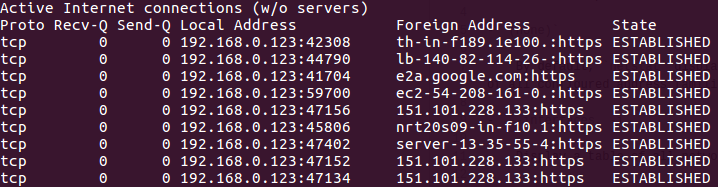
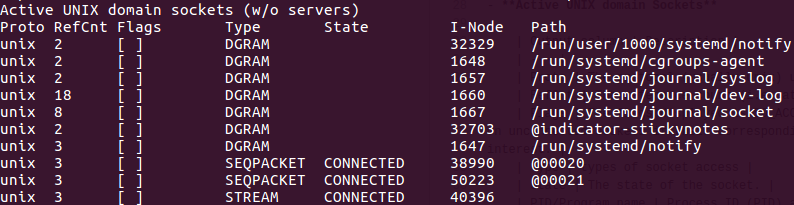

## Description

Print network connections, routing tables, interface statistics, masquerade connections, and multicast memberships. The type of information printed is controlled by the first argument, as follows:

- `(none)`

    By default, `netstat` displays a list of open sockets. If you don't specify any address families, then the active sockets of all configured address families will be printed.

- `--interfaces, -i`

    Display a table of all network interfaces.
    
    

## Output

- **Active Internet connections (TCP, UDP, raw)**

    | Output column | Description |
    | --- | --- |
    | Proto | The protocol (tcp, udp, raw) used by the socket. |
    | Recv-Q | The count of bytes not copied by the user program connected to this socket. |
    | Send-Q | The count of bytes not acknowledged by the remote host. |
    | Local Address | Address and port number of the local end of the socket. |
    | Foreign Address | Address and port number of the remote end of the socket. |
    | State | The state of the socket. |
    
    

- **Active UNIX domain Sockets**

    | Output column | Description |
    | --- | --- |
    | Proto | The protocol (usually unix) used by the socket. |
    | RefCnt | The reference count (i.e. attached processes via this socket). |
    | Flags | The flags displayed is SO_ACCEPTON (displayed as ACC), SO_WAITDATA (W) or SO_NOSPACE (N). SO_ACCECPTON is used on unconnected sockets if their corresponding processes are waiting for a connect request. The other flags are not of normal interest. |
    | Type | types of socket access |
    | State | The state of the socket. |
    | PID/Program name | Process ID (PID) and process name of the process that has the socket open. |
    | Path | This is the path name as which the corresponding processes attached to the socket. |
    
    

## Options

- `-n`

    Show numerical addresses instead of trying to determine symbolic host, port or user names.

- `-e`

    Display additional information.

- `-l, --listening`

    Show only listening sockets.  (These are omitted by default.)

- `-a`

    Show both listening and non-listening sockets.

- `[--tcp|-t] [--udp|-u] [--raw|-w]`
