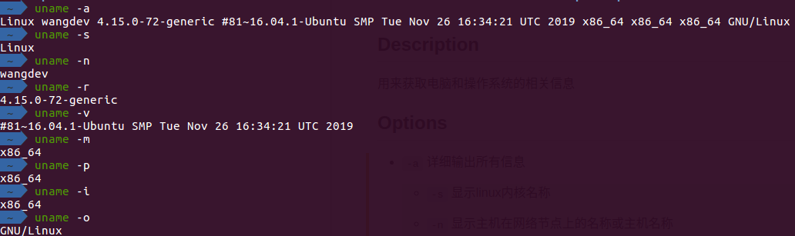

## Description

用来获取电脑和操作系统的相关信息

## Options

- `-a` 详细输出所有信息

    - `-s` 显示linux内核名称

    - `-n` 显示主机在网络节点上的名称或主机名称

    - `-r` 显示linux操作系统内核版本号

    - `-v` 显示操作系统版本

    - `-m` 显示主机的硬件（CPU）名

    - `-p` 显示处理器类型或unknown

    - `-i` 显示硬件平台类型或unknown

    - `-o` 显示操作系统名

    
